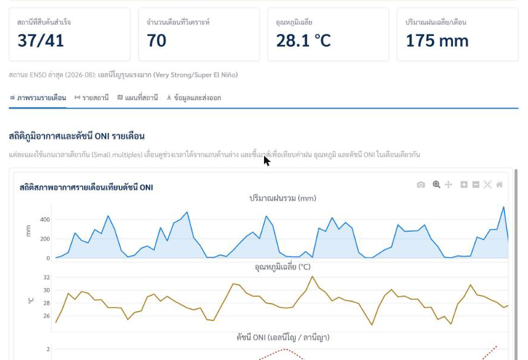
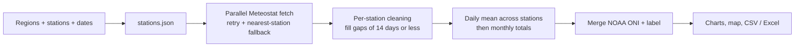

# Thai-Weather

**Live: [thaiweather.streamlit.app](https://thaiweather.streamlit.app)** (Thai interface)

Thai-Weather (ระบบรวบรวมและวิเคราะห์ข้อมูลอุตุนิยมวิทยา) collects daily observations from 127 Thai weather
stations, cleans them, and charts them by month next to NOAA's **Oceanic Niño Index (ONI)**, so you can see how
rain and temperature moved through El Niño and La Niña years.



## What it does

- **Pick regions, then stations.** Six regions, 127 stations, from 1950 to today (Bangkok time). The default is the
  last five years.
- **Fetches in parallel.** Up to 12 stations at a time. Network errors are retried with back-off. When a station
  has no data, the nearest *other* Meteostat station within 50 km stands in for it, the map shows where that data
  really comes from, and a fallback that is already counted is never averaged twice.
- **Cleans without guessing.** Interior gaps of up to 14 days are filled linearly per station; longer gaps stay
  empty. Missing rain stays missing instead of counting as 0 mm. Only the first and last months of the series are
  padded, and the app tells you which indicators are incomplete.
- **Adds ONI.** NOAA's seasonal ONI values are mapped to months and labelled by El Niño / La Niña strength.
- **Shows and exports.** Rain, temperature and ONI on one time axis, per-station charts, a station map, and CSV or
  Excel downloads that don't reset the page.

## Run it locally

Needs Python 3.11+ (pandas 3).

```bash
git clone https://github.com/thitichotk/thai-weather.git
cd thai-weather
python3 -m venv .venv
source .venv/bin/activate
pip install -r requirements.txt
streamlit run app.py              # http://localhost:8501
pip install pytest && python -m pytest tests   # the cleaning rules
```

Streamlit Community Cloud redeploys the app from `main`.

## How it works



| Path | Role |
|---|---|
| `app.py` | Streamlit page: inputs, results, charts, exports |
| `weather_fetcher.py` | Station list, Meteostat fetch with retry and fallback, NOAA ONI scrape |
| `data_processing.py` | Gap filling, daily and monthly aggregation, ONI labels, Excel export |
| `ui_components.py` | Region and station pickers, Plotly theme |
| `stations.json` | 127 stations keyed by WMO ID: `name`, `address`, `lat`, `lon`, `region` |
| `.streamlit/` | Theme (`config.toml`) and styling (`style.css`) |
| `tests/` | Checks for the gap-filling and rain rules |

Built with Streamlit 1.56, pandas 3, Plotly 6 and the Meteostat 2.1.4 Python library.

### Monthly output columns

| Field | Meaning | Unit |
|---|---|---|
| `year_month` | Year and month | `YYYY-MM` |
| `temp_mean` | Mean temperature | °C |
| `tmax_max` | Highest daily maximum in the month, after averaging across the selected stations | °C |
| `tmin_min` | Lowest daily minimum in the month, after averaging across the selected stations | °C |
| `rhum_mean` | Mean relative humidity | % |
| `wspd_mean` | Mean wind speed | km/h |
| `pres_mean` | Mean sea-level pressure | hPa |
| `prcp_sum` | Monthly rain: the daily mean of stations that reported, summed over the month | mm |
| `rainy_days` | Days with more than 0.5 mm | days |
| `ONI_Index` | NOAA ONI for the month | |
| `ONI_Label` | El Niño / La Niña strength | |

### ONI labels

| ONI | Label |
|---|---|
| 2.0 or more | El Niño, very strong |
| 1.5 to 1.9 | El Niño, strong |
| 1.0 to 1.4 | El Niño, moderate |
| 0.5 to 0.9 | El Niño, weak |
| -0.4 to 0.4 | Neutral |
| -0.9 to -0.5 | La Niña, weak |
| -1.4 to -1.0 | La Niña, moderate |
| -1.9 to -1.5 | La Niña, strong |
| -2.0 or less | La Niña, very strong |

## Troubleshooting

- **`certificate verify failed` on macOS:** the app already points OpenSSL at `certifi`'s bundle. If you run the
  code outside `app.py`, set `SSL_CERT_FILE=$(python -m certifi)` yourself. Certificate checks stay on.
- **`No module named 'meteostat.api'`:** the install was interrupted. Run
  `pip install --force-reinstall --no-cache-dir meteostat==2.1.4`.
- **Slow or failing fetches:** pick fewer stations or a shorter range. The per-station log on the results page
  says why each station failed.

## Credits and licence

- **Weather:** [Meteostat](https://dev.meteostat.net/) ([CC BY 4.0](https://creativecommons.org/licenses/by/4.0/)),
  which publishes observations from Thai Meteorological Department stations among others.
- **ONI:** [NOAA Climate Prediction Center](https://www.cpc.ncep.noaa.gov/products/analysis_monitoring/enso/oni/v6/) (ERSSTv6).

[MIT](LICENSE) © 2026 Thitichot K.

An independent project, not an official website of any government agency, and not affiliated with the Thai
Meteorological Department, NOAA or the Bank of Thailand. The TMD and NOAA logos only credit where the data comes from,
and the styling follows the Bank of Thailand's design system.
